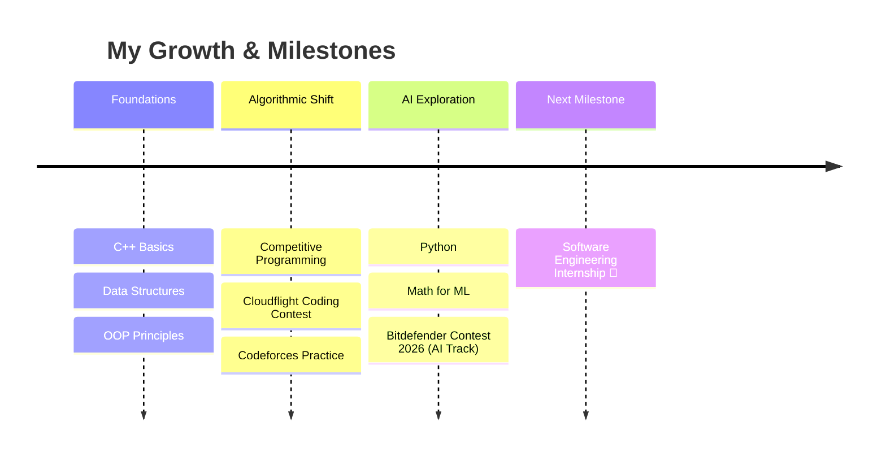

# 🌍 How do you keep up with a world that updates its parameters every single second?

I'm **Ștefan** and I don't just follow the trends — I adapt, optimize, and help build the logic behind them. 🚀

As an Automation and Computer Science student at the **Technical University of Cluj-Napoca (UTCN)**, I’ve learned that the only constant in technology is continuous change. For me, engineering is about evolution and breaking down complex, ever-shifting systems into elegant, high-performance software. 🤖

Instead of just keeping pace, I treat every algorithmic challenge as a step toward mastering this landscape. 💻

---

## 🚀 The TL;DR About Me
I am a software engineering enthusiast who thrives at the intersection of **complex mathematical logic** and **practical AI deployment**. Instead of just writing code, I focus on *efficiency, time complexity, and scalable architectures*. I'm currently looking to bring this problem-solving mindset to a high-impact team through an **internship** or **Junior Software Engineer** role.

---

## 🏎️ Coding Journey & Milestones (Timeline)

---

## 🛠️ My Tech Toolbox

### 🧱 Core Engineering & Languages

  

### 🤖 Data Science & Infrastructure

  

---

## 🎯 Featured Challenges & Focus Areas

### 🏆 1. Competitive Programming
* **The Goal:** Cracking complex algorithmic riddles under tight time and memory constraints.
* **Current Tracks:** actively building and refactoring solutions for the **Cloudflight Coding Contest** and optimizing data structures.
* **Core Strengths:** Deep understanding of Graphs, Dynamic Programming, and Advanced Math.

### 🤖 2. Artificial Intelligence Track
* **The Goal:** Bridging the gap between raw data and smart automation.
* **Current Tracks:** Building custom logic and optimizing models for the **Bitdefender Programming Contest 2026 AI Track**.

---

## 📊 Live GitHub Analytics

  
  

  

---

## ⚡ Beyond the Code
* 🧩 I treat debugging like solving an escape room.
* 📈 I firmly believe that an $O(N \log N)$ solution is always worth the extra sweat over an $O(N^2)$ one.
* ☕ Powered by curiosity and a lot of coffee.

---

## 📬 Let's Build Something Cool!

  
  

---

  

